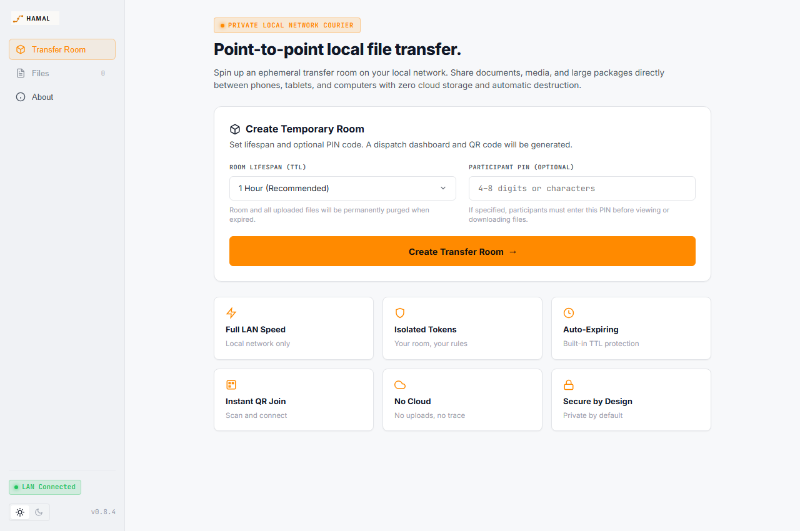
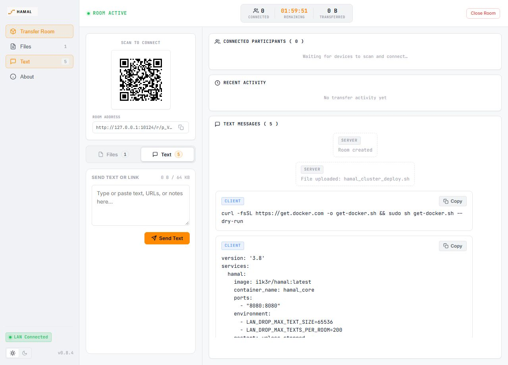
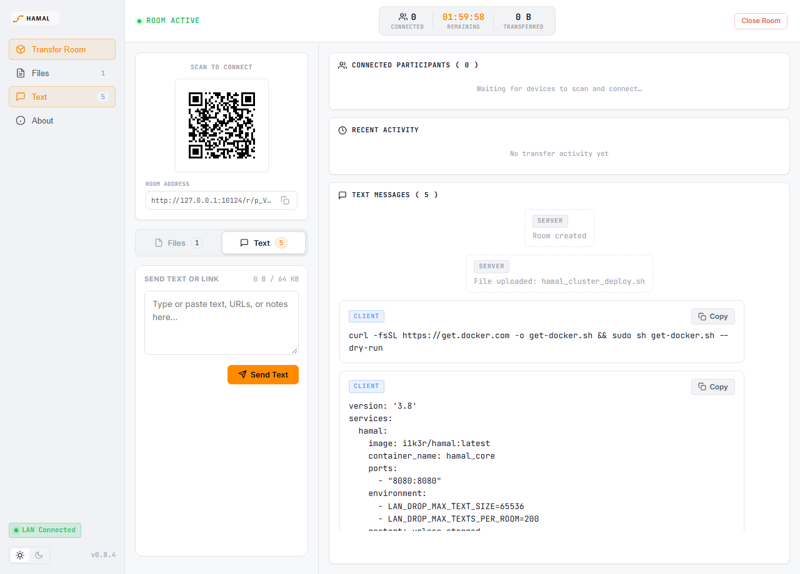
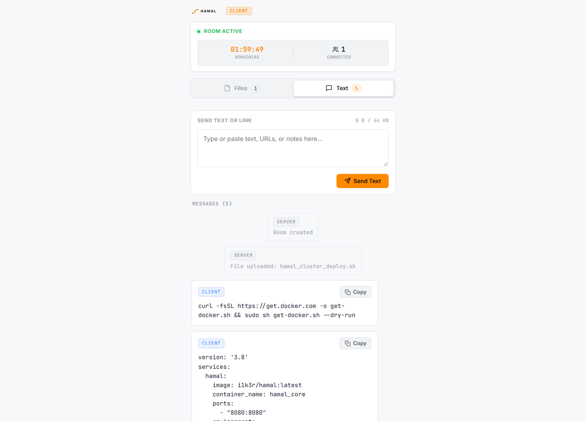

<div align="center">


# HAMAL

**Fast, private, temporary file and clipboard transfer.**

[](https://golang.org)
[](Dockerfile)
[](unraid-template.xml)
[](LICENSE)

</div>

---

## What is HAMAL?

**HAMAL** (Turkish for *porter* / *carrier*) is a lightweight, self-hosted web application for temporary file and text transfers between devices on the same LAN / Wi-Fi network.

The idea is simple: create a temporary room, share the generated QR code or local link, and move digital cargo between devices without a cloud upload, account system, advertising, or telemetry.

HAMAL is built around short-lived transfer rooms rather than permanent storage. Rooms expire automatically, and their temporary files and text follow the room lifecycle.

### How it works

1. Create a temporary room.
2. Optionally protect it with a PIN.
3. Scan the QR code or open the local room link.
4. Transfer files or send temporary text between connected devices.
5. Let the room expire automatically, or close it manually.

---

## Screenshots

The current interface uses a dark, high-contrast visual language with warm amber accents and responsive layouts for desktop and mobile.

<div align="center">

### Home / Create Room


<br/><br/>

### Creator Dashboard


<br/><br/>

### Temporary Text / Clipboard


<br/><br/>

### Client — Desktop



</div>

---

## Key Features

- 📋 **Temporary Text / Clipboard**: Send plain text, commands, logs, JSON/YAML, URLs, configuration snippets, and other technical text through the same temporary room.
- 🔄 **Two-Way CLIENT ↔ CLIENT Text Sharing**: Both devices can send text through the same room. Messages are labelled **CLIENT** and system activity is labelled **SERVER**.
- 📎 **One-Click Copy**: Every shared client message can be copied as the original plain text, preserving multiline content and formatting.
- 🚀 **Zero Setup for Participants**: Scan a QR code or open a local link to immediately upload/download files or use the temporary Text / Clipboard channel.
- ⏱️ **Auto-Expiring Rooms**: Rooms automatically expire and clean up temporary content after a configurable TTL.
- 🔒 **PIN Protection**: Optional 4–8 digit PIN with exponential backoff and lockout to prevent brute-force attacks.
- 📦 **True Streaming I/O**: Multi-gigabyte transfers stream directly to disk without exhausting server RAM.
- 🎨 **Responsive HAMAL UI**: Dark-first interface with warm amber accents, plus a preserved light theme for users who prefer it.
- 🔍 **Interactive QR Lightbox**: One-click smooth zoom for scanning QR codes from across the room.
- 🛡️ **Self-Hosted & Private**: Zero cloud dependencies, zero external analytics, zero tracking.

Text messages are temporary and scoped to their room. They are removed with the room lifecycle; the text channel is a technical clipboard rather than a permanent chat application. Each message is limited to 64 KB, with up to 200 messages per room.

---

## Quick Start

### Using Docker Compose (Recommended)

1. Clone the repository:
   ```bash
   git clone https://github.com/i1k3r/HAMAL.git
   cd HAMAL
   ```

2. Copy the sample environment file:
   ```bash
   cp compose.example.env .env
   ```

3. Start the container:
   ```bash
   docker compose up -d
   ```

4. Open your browser and navigate to:
   ```
   http://localhost:7700
   ```

---

### Unraid Installation

1. Place [`unraid-template.xml`](unraid-template.xml) into `/boot/config/plugins/dockerMan/templates-user/` on your Unraid flash drive.
2. Go to the **Docker** tab in Unraid and click **Add Container**.
3. Select **HAMAL** from the template list.
4. Set your preferred web UI port and appdata directory path (`/mnt/user/appdata/hamal`), then click **Apply**.

---

### Manual Binary Build (Go)

Prerequisites: Go 1.22+, GCC / CGO (for SQLite support).

```bash
# Clone the repository
git clone https://github.com/i1k3r/HAMAL.git
cd HAMAL

# Run tests
go test ./...

# Build the executable
go build -o hamal ./cmd/lan-drop

# Run HAMAL
./hamal
```

---

## Configuration

HAMAL is configured via environment variables:

| Variable | Default | Description |
| :--- | :--- | :--- |
| `LAN_DROP_LISTEN_ADDR` | `:7700` | Address and port to bind the HTTP server |
| `LAN_DROP_DATA_DIR` | `/data` | Root directory for SQLite DB, temporary files, and secrets |
| `LAN_DROP_DEFAULT_TTL` | `1h` | Default room lifetime |
| `LAN_DROP_MIN_TTL` | `5m` | Minimum allowed room lifetime |
| `LAN_DROP_MAX_TTL` | `24h` | Maximum allowed room lifetime |
| `LAN_DROP_MAX_FILE_SIZE` | `10737418240` (10 GB) | Maximum size of an individual file |
| `LAN_DROP_MAX_ROOM_SIZE` | `10737418240` (10 GB) | Maximum aggregate file storage per room |
| `LAN_DROP_MAX_FILES_PER_ROOM`| `100` | Maximum number of files per room |
| `LAN_DROP_CLEANUP_INTERVAL` | `1m` | Frequency of background room and orphan file sweeps |
| `LAN_DROP_LOG_FORMAT` | `json` | Log format (`json` or `text`) |
| `LAN_DROP_LOG_LEVEL` | `info` | Log verbosity (`debug`, `info`, `warn`, `error`) |
| `LAN_DROP_SECURE_COOKIES` | `auto` | Cookie security (`auto`, `true`, `false`) |
| `LAN_DROP_TRUSTED_PROXIES` | *(empty)* | Comma-separated trusted proxy IPs/CIDRs. When using an HTTPS-terminating reverse proxy, configure this or set `LAN_DROP_SECURE_COOKIES=true` so session cookies receive the `Secure` attribute. |

---

## Official Desktop Applications

HAMAL is available as a native, zero-cloud desktop application for multiple platforms:

- **[HAMAL for Windows](https://github.com/i1k3r/HAMAL-Windows)**: Native Windows desktop client packaged with MSIX and Microsoft Store distribution support.
- **[HAMAL for Linux](https://github.com/i1k3r/HAMAL-Linux)**: Native Linux desktop application and Snap package with WebKit2GTK engine and 20-language support.

---

## Brand Assets

Official HAMAL vector logos and icons are available in the [`brand/`](brand/) directory:

- `brand/hamal-logo-dark.svg` (Horizontal dark-mode wordmark)
- `brand/hamal-logo-light.svg` (Horizontal light-mode wordmark)
- `brand/hamal-logo-stacked.svg` (Stacked badge wordmark)
- `brand/hamal-app-icon.svg` (Square container icon)
- `brand/hamal-monochrome.svg` (Monochrome asset)
- `brand/hamal-path-mark.svg` (Vector path symbol)

---
## License

HAMAL is source-available software licensed under the
[HAMAL Source-Available Organizational Use License](LICENSE).

Organizations may freely use, modify, fork, and deploy HAMAL for their own
internal operations, including commercial business operations.

Commercial redistribution, resale, productization, and offering HAMAL or
derivative works as a commercial service require separate permission from the copyright holder.